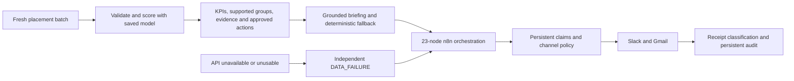

# UrbanEats — placement-time operations intelligence

A forward-deployed engineering (FDE) project that connects placement-time risk assessment
to evidence-grounded operational briefs and auditable notification delivery.

Release: `urbaneats-ops-intelligence-v1.0.0`.

## Operations problem and solution

Operations teams need a current, traceable basis for reviewing restaurant and delivery-zone
risk. Historical scored orders cannot establish current conditions, and missing or malformed
input must never become an all-clear message. A useful workflow must also handle unavailable
services, duplicate executions and uncertain delivery receipts.

UrbanEats addresses that operating boundary with a local Python API and a **23-node n8n
workflow**. The API validates a fresh placement batch, loads a versioned model, identifies
supported review groups and produces cited evidence. n8n turns that assessment into
policy-gated Slack/Gmail delivery with persistent claims, bounded retries and an audit trail.
When the API is unavailable, n8n constructs a separate DATA_FAILURE brief rather than
reusing an earlier assessment.

The engineering result is a verified end-to-end system with explicit failure behavior.
The predictive model remains **exploratory and uncalibrated**; this is not evidence of
production predictive readiness or reduced cancellations.

## End-to-end architecture



| Component | Responsibility |
|---|---|
| Python API | Placement validation, trusted model loading, inference, KPIs, supported hotspots, evidence/actions, briefing and run persistence |
| Briefing/provider boundary | Canonical facts and citations, optional Groq formatting, output validation and deterministic fallback |
| n8n | Schedule/manual triggers, API calls, independent outage reporting, duplicate suppression, channel gates, receipts, bounded retries and native Data Table audit |

The runtime never retrains during a request. Workflow source has one chain:
[orchestration logic](workflows/n8n/orchestration_logic.cjs) +
[notification logic](workflows/n8n/notification_logic.cjs) →
[builder](scripts/build_workflow.py) → [canonical export](workflows/n8n/urbaneats_live.json).
Builder equality is part of the accepted verification.

## Placement-time prediction contract

Prediction occurs **after checkout is finalized and before fulfillment**. The model uses
only restaurant, delivery zone, order value, payment method and checkout discount. Order
IDs provide lineage; timezone-aware placement/source timestamps enforce freshness rather
than becoming predictors. Outcome/status, final delivery time, ratings, complaints and
previous scores are rejected from the placement API.

The target is **Cancelled versus Delivered**, conditional on those two terminal outcomes.
Delayed and Refunded records are excluded from training and evaluation. The source lacks
verified placement snapshots, cancellation timestamps and a maturity horizon, so scores
do not establish overall or fixed-horizon cancellation probability for every new order.
The default freshness limit is one hour. See the
[feature and prediction-point contract](docs/FEATURE_CONTRACT.md).

## Model results and limitations

Model version: `UE-23c30780e69023fb`. The selected logistic-regression pipeline uses a
saved **0.30 probability threshold**, chosen from development out-of-fold results before
holdout evaluation. The dataset contains 80 eligible synthetic labels; the holdout has
20 records, including nine Cancelled outcomes.

| Holdout metric | Measured result |
|---|---:|
| Precision | 0.4167 |
| Recall | 0.5556 |
| F1 | 0.4762 |
| ROC-AUC | 0.4545 |
| Average precision | 0.5613 |
| Brier score | 0.3109 |
| Review burden | 12/20 |

These results do not validate a reliable production predictor: the prior baseline performs
better on F1, ROC-AUC, Brier score and the provisional review cost. The model is uncalibrated
and metadata records `production_ready=false`. The final saved artifact was refitted on all
80 eligible labels after evaluation; the reported holdout assessed the development-fitted
pipeline, not an independent test of that final refit. See
[evaluation protocol and comparison](docs/EVALUATION.md) and [measured evidence](evaluation/results/metrics.json).

## Supported hotspots and routing

A restaurant/zone group needs **at least 20 current records** and an **unrounded
model-flagged fraction greater than 30%** to become a supported hotspot. Groups below
the support floor remain explicit `INSUFFICIENT_SUPPORT` evidence and trigger no hotspot
action. These are demonstration review-policy settings, not validated operational cutoffs.
The approved hotspot action is **MANUAL_REVIEW**.

The predicted-risk fraction counts orders whose model score meets the saved threshold.
It is **not an observed cancellation rate**. Placement input has no observed outcome KPI.

| Route | Operational meaning | Slack | Gmail |
|---|---|---|---|
| GREEN_SUMMARY | No supported predicted-risk hotspot; does not mean business health | SKIPPED_POLICY | Required |
| RED_ALERT | Supported predicted-risk hotspot; manual review required | Required | Required |
| DATA_FAILURE | Input/runtime evidence unavailable or invalid, or independent API outage | Required | Required |

## Grounded briefing and delivery safety

Every operational claim comes from canonical evidence sentences with exact citations and
approved action IDs. Optional Groq formatting may reorder those sentences; it cannot invent
facts, causes or actions. Required batch/hotspot citations must remain. Unsupported output
or provider failure falls back to a deterministic briefing without changing the assessment.

The canonical n8n export is **inactive**, scheduled for **07:30 Asia/Kolkata**, and contains
one Slack and one Gmail node. **TEST_MODE=true**, both send nodes are disabled/unbound,
and destinations are `CONFIGURE_LOCALLY`. API TEST_MODE independently blocks hosted calls.
Credentials, OAuth secrets, tokens and private recipients belong only in ignored private
configuration or local n8n bindings, never in Git.

Native Data Tables preserve duplicate claims and prepared/channel/completion audits.
API retries and definite rate-limit delivery retries are bounded at three attempts.
Ambiguous required receipts become `notification_unverified`, keep their claims and do
not retry automatically. Channel outcomes remain independent. See
[runtime details](docs/RUNTIME.md) and [automation contract](docs/LIVE_AUTOMATION.md).

## Fresh-clone setup

Requirements: **Python 3.12**, Node.js on PATH for offline JavaScript tests, and Docker
Desktop with Linux containers for API/native n8n verification. These commands use
PowerShell and the pinned development requirements.

```powershell
git clone <repository-url> UrbanEats
Set-Location UrbanEats
git checkout urbaneats-ops-intelligence-v1.0.0
py -3.12 -m venv .venv
.venv\Scripts\python.exe -m pip install -r requirements-dev.txt
.venv\Scripts\python.exe -m pip install --no-deps -e .
```

**Provision the trusted model before inference or the full test suite.** Git tracks
model metadata, feature contract and threshold, but deliberately ignores `pipeline.joblib`.
Obtain the accepted binary from a trusted project artifact holder and place it at
`artifacts/model/pipeline.joblib`. Its expected SHA256 is
`cefdec41be4ee8e9caa14111141bdb0c99e03918039667019e367ebdccca1fe1`;
confirm it against [model metadata](artifacts/model/metadata.json):

```powershell
Get-FileHash artifacts/model/pipeline.joblib -Algorithm SHA256
```

A clone alone is not a self-contained model distribution. Do not load an untrusted joblib
file or regenerate the frozen model/evaluation as a substitute for this prerequisite.

Start a clearly marked synthetic demo on the Docker API:

```powershell
$env:TEST_MODE = 'true'
$env:LLM_PROVIDER = ''
.venv\Scripts\python.exe scripts/current_demo.py --scenario red
docker compose -p urbaneats -f docker/compose.yaml up -d --build urbaneats-api
Invoke-RestMethod http://127.0.0.1:8000/health
Invoke-RestMethod -Method Post http://127.0.0.1:8000/process-current
```

Use `--scenario green` or `--scenario failure` to create other demo inputs. Demo batches
are inference fixtures, never new training data. Health should report READY, the model
version above, `model_loaded=true` and `threshold_loaded=true`. The API is loopback-bound
at port 8000. The Compose command starts only the API; the managed n8n profile is opt-in.
Import the canonical inactive export only when following the
[n8n setup instructions](docs/LIVE_AUTOMATION.md).

## Reproducible verification and accepted evidence

After provisioning the trusted model:

```powershell
.venv\Scripts\python.exe -m pytest -q --basetemp=.pytest_tmp_checks -p no:cacheprovider
.venv\Scripts\python.exe -m ruff check .
.venv\Scripts\python.exe -m pip check
git diff --check
.venv\Scripts\python.exe scripts/security_scan.py --output docker/local/checks/security_scan.json
.venv\Scripts\python.exe scripts/build_workflow.py --output docker/local/checks/workflow.json
```

The alternate builder output allows comparison with the canonical export without replacing
it. With the TEST_MODE API running on port 8000, run the full native harness separately:

```powershell
.venv\Scripts\python.exe scripts/verify_notification_integration.py --output docker/local/checks/native_verification.json
```

It imports the canonical graph into disposable n8n 2.41.6 state, uses local fixtures and
mock receipts, exercises outage/recovery and removes its containers. It never mounts
persistent `n8n_data`, injects credentials or sends real notifications. New checks write
local outputs so accepted release evidence is preserved.

| Accepted engineering check | Result and evidence |
|---|---|
| Regression, lint and dependencies | **148 tests, zero warnings**; Ruff, pip check and diff check PASS in the [release audit](docs/PREFREEZE_AUDIT.md) |
| Native integration | **24/24 PASS**, public import PASS, zero real notifications/hosted calls in [native evidence](evaluation/results/final_native_verification.json) |
| Actual canonical n8n execution | **GREEN_SUMMARY / RED_ALERT / DATA_FAILURE PASS**, TEST_MODE skips and bounded retry completion in [execution evidence](evaluation/results/final_n8n_execution_verification.json) |
| API | **READY**, required model version and loaded model/threshold in [API smoke evidence](evaluation/results/final_api_smoke.json) |
| Security | **0 current findings** in [security evidence](evaluation/results/final_n8n_security_scan.json) |
| Integrity | **48/48 protected artifacts PASS** in [execution regression gates](evaluation/results/final_n8n_execution_verification.json) |
| Behavioral equivalence | **17/17 identical** in [comparison evidence](evaluation/results/final_behavioral_diff.json) |

These are recorded isolated engineering checks, not live-channel acceptance or production
model validation. The [engineering report](docs/FINAL_CODE_REMEDIATION.md) records design
decisions, compatibility boundaries and remaining technical limitations.

## Repository structure

| Path | Purpose |
|---|---|
| `src/urbaneats/` | API, validation, trusted inference, evidence, briefing and presentation |
| `workflows/n8n/` | Canonical 23-node export, reviewed JavaScript and workflow documentation |
| `scripts/` | Workflow builder, synthetic demo input and verification/security tools |
| `tests/` | Offline runtime, formatter, routing, receipt, retry and harness regression coverage |
| `artifacts/model/` | Model contract, metadata, threshold and provisioned trusted local binary |
| `evaluation/` | Evaluation implementation and frozen measured/verification evidence |
| `data/` | Placement examples/contracts and ignored current local source |
| `docker/` | Pinned API/n8n deployment; ignored local diagnostics |
| `docs/` | Contracts, operating instructions, engineering evidence and explicit history |
| `runs/` | Ignored local immutable API/delivery audit state |
| Root datasets/notebooks | Original assignment provenance, not current live input |

## Original assignment provenance

The original baseline is `c62430075fc5ccaaa5db487a7556d531ac128c63`
(`assignment-baseline-v1`). Supplied datasets, scored CSV, notebooks, alerts, brief and
sanitized original workflow remain at their accepted paths. The original
[README snapshot](docs/history/README_PRE_3B1.md) is unchanged.
[Historical reports](docs/history/README.md) and [archived workflow graphs](workflows/n8n/history/README.md)
preserve the evolution; their earlier commands and node counts do not describe the
current 23-node canonical system.
